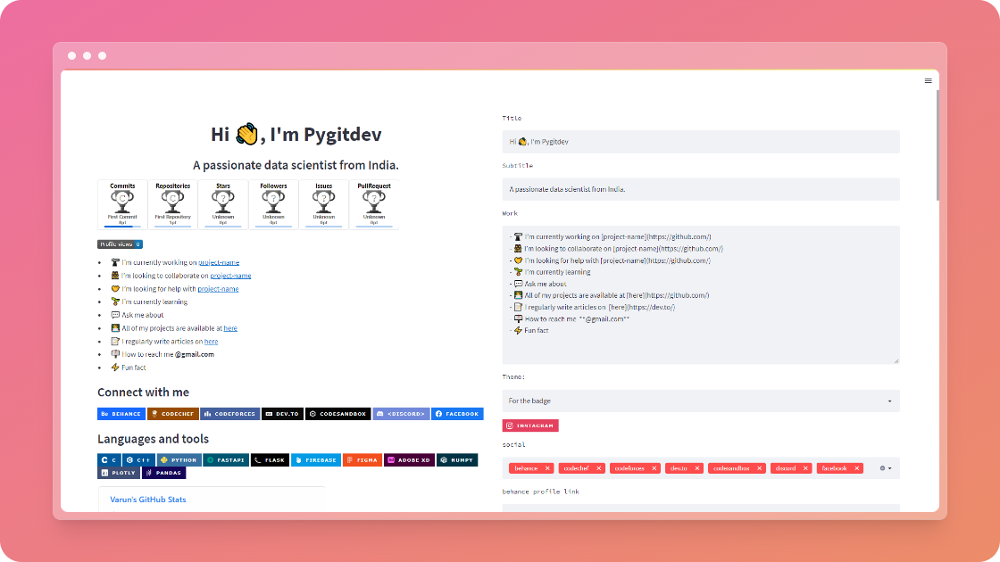

<!-- fav/title -->
<p align="center">

</p>
<h1 align="center">GitHub Profile Readme Generator</h1>

<!-- preview -->
<br>
<p>This web app provides you an easy way to create a awesome GitHub Profile Readme with multi-options</p>

## Demo
[](https://share.streamlit.io/pygitdev/github-profile-readme-generator/main/app.py)

<!-- features -->
## 💡 Features <br>
In less than 10 mins you can create an awesome GitHub PROFILE README by just file some inputs
- **live preview**
- **Image/svg Banner**
- **Social Badges**
- **Dev Badges**
- **7 Different skill categories**
- **Random Meme/Quote**
- **Profile Visitors Count Badge**
- **GitHub Streak card**
- **GitHub Top Skills card**
- **GitHub Stats card**
- **GitHub Trophy card**
- **live raw code preview**
- **readme typing banner**

<!-- features -->
## 🎈 Upcoming  Features <br>
- **some templates are going to add**
- **Latest blog section**
- **Animation Banner**
- **Adding more badges**


## 🏗️ Build with
 <!-- top badges -->


## ✨ Contributing
##### Feature Suggestion and Problems 💎
Go to Issues on the repo.
 - Create an explaining the Feature.
 - If you find any errors/issues, feel free to create an Issue.

## 🛠️ Installation Steps
1. Clone the repository
    ```shell
   git clone https://github.com/pygitdev/github-profile-readme-generator.git
   ```
2. Change the working directory
   ```shell
   cd github-profile-readme-generator
   ```
3. Change the working directory
   ```shell
   pip install -U pip virtualenv or venv/Scripts/activate
   ```
4. Install required dependencies
   ```shell
   pip install -r requirements.txt
   ```
5.  Run the App
    ```shell
      streamlit run app.py
    ```

😃 You are all set!

## 🙏 Support
[](https://twitter.com/pygitdev_)
[](https://www.instagram.com/pygitdev/)
