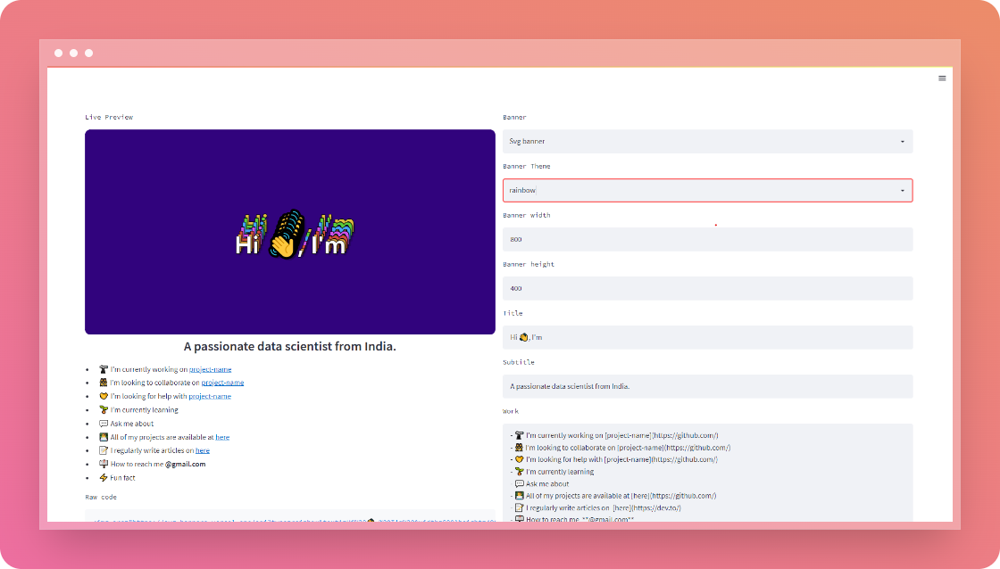

<!-- fav/title -->
<p align="center">


</p>
<h1 align="center">GitHub Profile Readme Generator</h1>

<!-- preview -->
<br>
<p>This web app provides you an easy way to create a awesome GitHub Profile Readme with multi-options</p>

## Demo
[]()

<!-- features -->
## 💡 Features <br>
@@ -29,51 +25,15 @@ In less than 10 mins you can create an awesome GitHub PROFILE README by just fil

- **some templates are going to add**
- **Image Banner**
- **Latest blog section**
- **Animation Banner**
- **Random Meme/Quote**
- **Adding more badges**
- **Increasing number of social Icons**

## 🏗️ Build with
 <!-- top badges -->
<p align="center">
 


## ✨ Contributing
##### Feature Suggestion and Problems 💎
Go to Issues on the repo.
 - Create an explaining the Feature.
 - If you find any errors/issues, feel free to create an Issue.

## 🛠️ Installation Steps
1. Clone the repository
    ```shell
   git clone https://github.com/pygitdev/github-profile-readme-generator.git
   ```
2. Change the working directory
   ```shell
   cd github-profile-readme-generator
   ```
3. Change the working directory
   ```shell
   pip install -U pip virtualenv or venv/Scripts/activate
   ```
4. Install required dependencies
   ```shell
   pip install -r requirements.txt
   ```
5.  Run the App
   ```shell
   streamlit run app.py
   ```
😃 You are all set!

## 🙏 Support
[](https://twitter.com/pygitdev_)
[](https://www.instagram.com/pygitdev/)

 


 
</p>